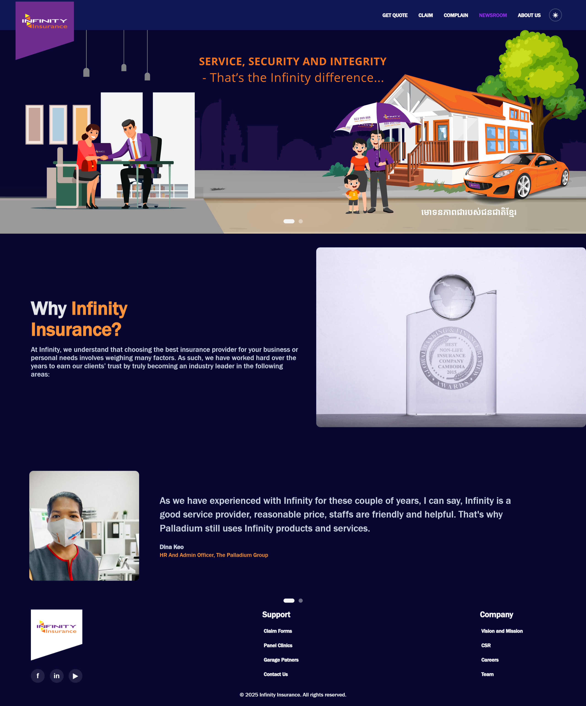
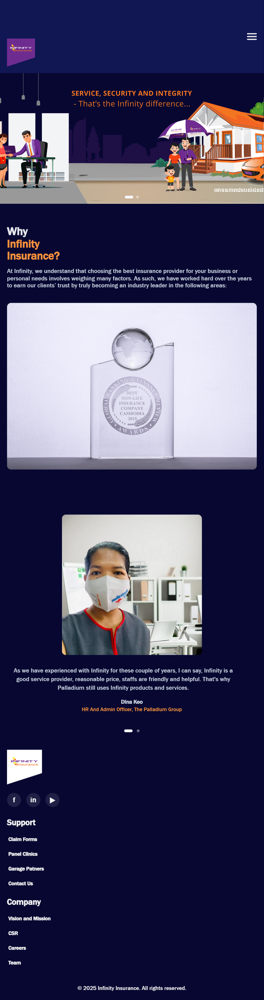

# Infinity Insurance Website Clone

**Created by: Nhoung Norakchivorn**

## 🔗 Live Demo
[View Live Site](https://chivorn99.github.io/infinity-insurance-clone/)

## 📸 Screenshots

### Desktop View


### Mobile View


## ✨ Implemented Features

### Interactive Elements
1. **Hamburger Menu** - Mobile-responsive navigation that opens/closes on click
2. **Navbar Scroll Effect** - Header background changes and shrinks when scrolling down
3. **Hover States** - All buttons and links have distinct hover effects
4. **Horizontal Scroll Banners** - Touch-friendly carousel for hero and testimonials
5. **Responsive Design** - Fully responsive across desktop, tablet, and mobile devices

### Sections
- Sticky navigation header with theme toggle
- Hero banner with manual scroll
- About Us section with grid layout
- Customer testimonials carousel
- Footer with social media links

## 🎨 Credits

### Images
- Hero Banner: [Infinity Insurance](https://www.infinity.com.kh/)
- About Us Photo: [Infinity Insurance](https://www.infinity.com.kh/)
- Employee Photos: [Infinity Insurance](https://www.infinity.com.kh/)

### Fonts
- System fonts (Franklin Gothic Medium, Arial)

### Icons
- Unicode symbols for social media and theme toggle

## 💻 How to Run Locally

1. Clone this repository:
   ```bash
   git clone https://github.com/yourusername/infinity-insurance-clone.git
   ```

2. Navigate to project folder:
   ```bash
   cd infinity-insurance-clone
   ```

3. Open `index.html` in your browser, or use Live Server in VS Code

## 📁 Project Structure
```
infinity-insurance-clone/
├── index.html
├── style.css
├── favicon.ico
├── README.md
└── assets/
    └── images/
        ├── logo.png
        ├── hero.svg
        ├── reward.jpg
        └── employees.svg
```

## 📝 Notes
- All images are optimized to be under 200KB
- CSS-only hamburger menu (no JavaScript except scroll effect)
- Follows accessibility best practices with ARIA labels